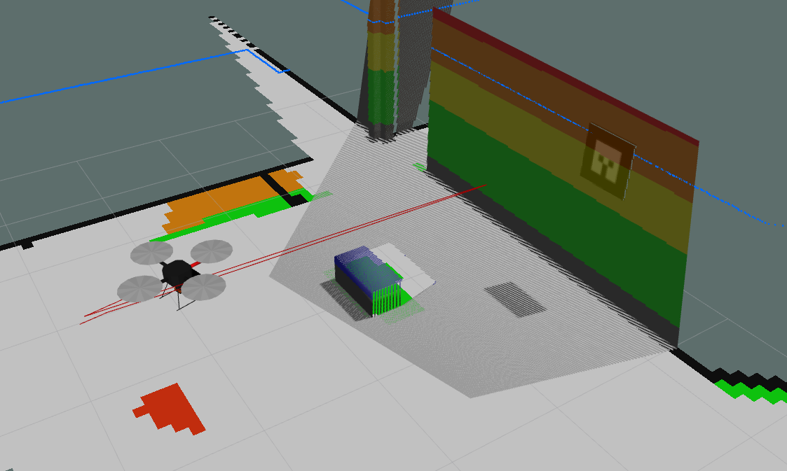

## Installation

Download [Hector SLAM](https://github.com/tu-darmstadt-ros-pkg/hector_slam) ROS package,

```
$ cd ~/catkin_ws/src
$ git clone https://github.com/tu-darmstadt-ros-pkg/hector_slam.git
```

Download depthcam_hector_slam package and replace Hector Mapping node with the included one,

```
$ git clone https://github.com/jimcha21/depthcam_hector_slam.git
$ cp slammin/hector_mapping/src/{HectorMappingRos.cpp,HectorMappingRos.h} hector_slam/hector_mapping/src/
```
and build,
```
$ catkin_make install
```

Todo-> Add launch files, Add Gazebo simulated world
